# Airbnb NYC Market Analysis

An end-to-end data exploration and visualization project analyzing over 48,000 Airbnb listings in New York City. The goal is to uncover actionable insights about pricing, availability, reviews, and room type patterns across neighbourhood groups using Python-based EDA and Tableau storytelling.

---

## 📈 Project Overview

- Dataset of ~48,000 Airbnb listings for NYC
- Cleaned, structured, and explored using Python (pandas, seaborn, matplotlib)
- Built a complete Tableau dashboard for clear visual storytelling
- Delivered 20+ polished visuals highlighting trends, outliers, and patterns

This project demonstrates practical data analysis, visualization, and communication skills for business-facing analytics use cases.

---

## 🗺️ Key Insights

✅ Significant price differences between Manhattan, Brooklyn, and other boroughs  
✅ Clear segmentation by room type, driving pricing strategy  
✅ Availability trends that highlight market gaps  
✅ Minimum stay requirements vary by neighbourhood and room type  
✅ Review volume and ratings signal demand and reputation  

---

## 🖼️ Complete Visual Gallery

All final visuals are included below for easy viewing.

---

### ✅ Tableau Dashboard
> **Overall, one-page interactive summary of key metrics and heatmaps.**


---

### ✅ Tableau KPI and Bar Charts

> **Distribution of listings and average metrics by neighbourhood and room type.**

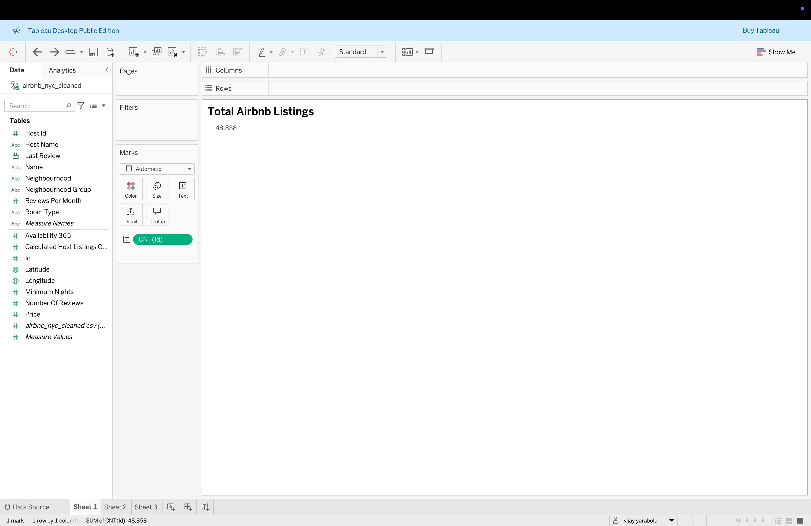
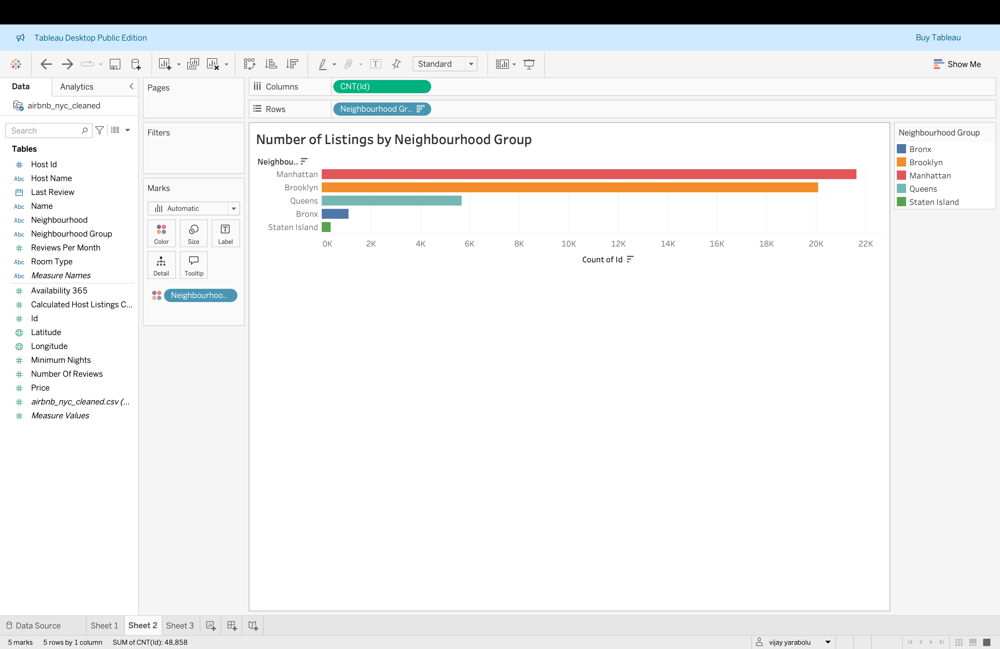
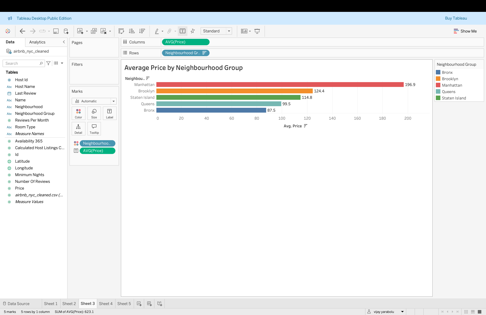
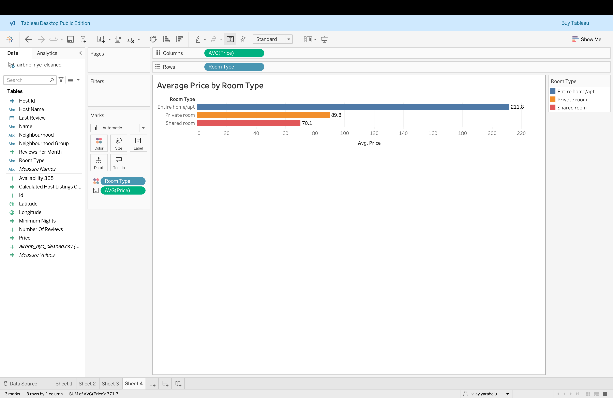
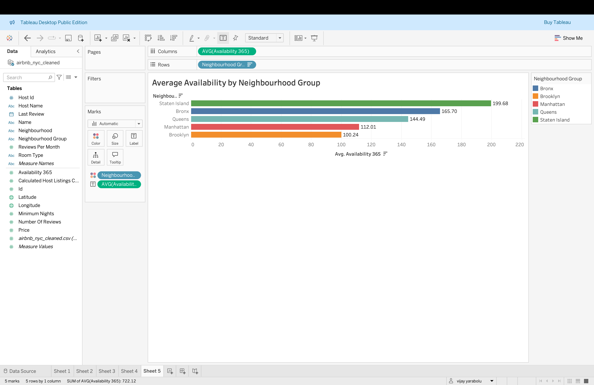


---

### ✅ Tableau Heatmaps

> **Detailed cross-analysis of price, availability, minimum nights, and reviews by neighbourhood group and room type.**

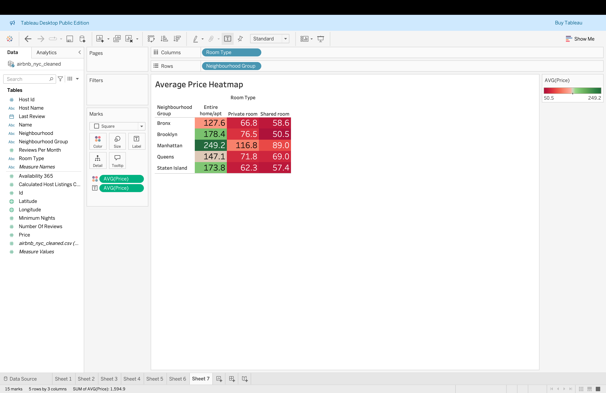
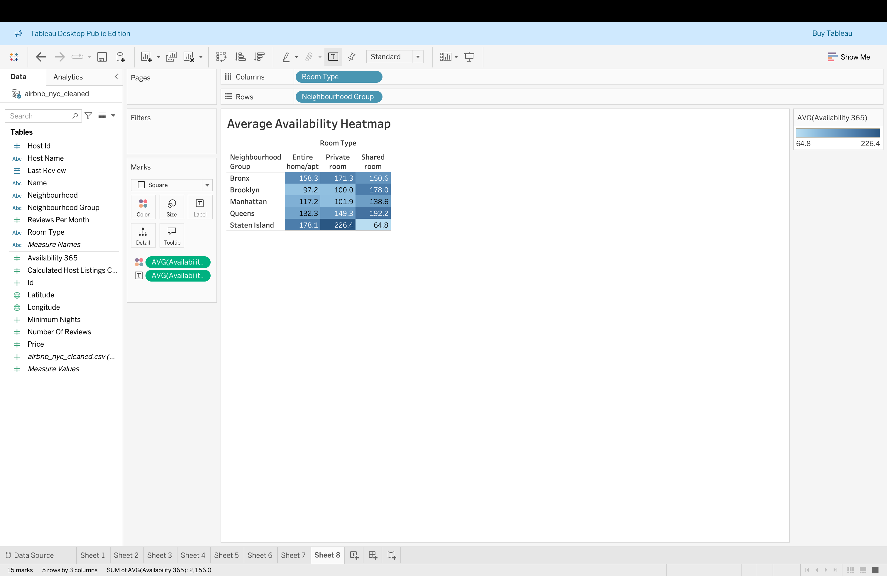
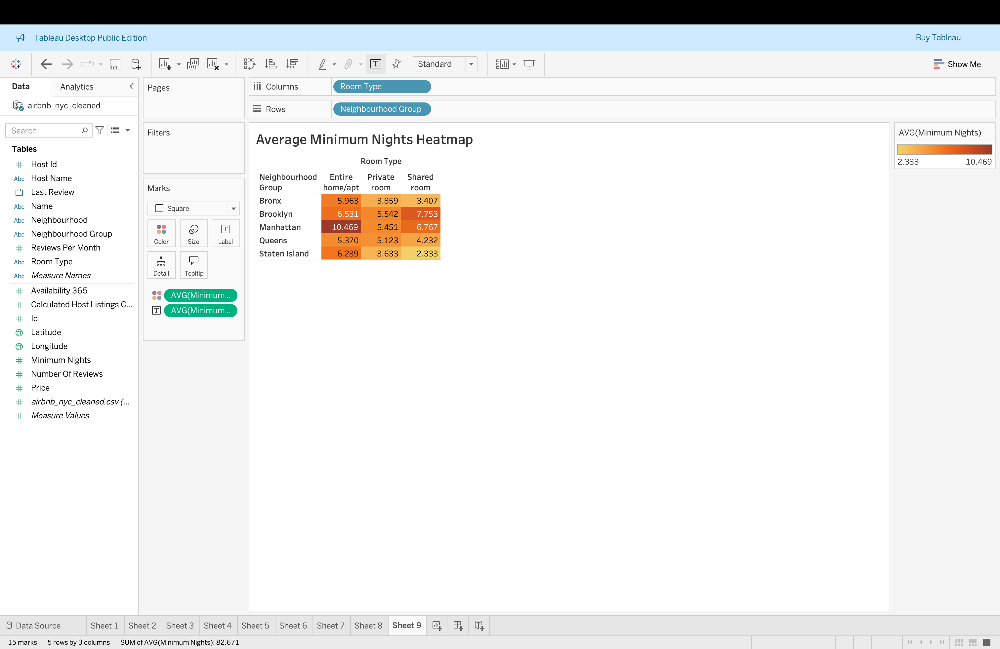
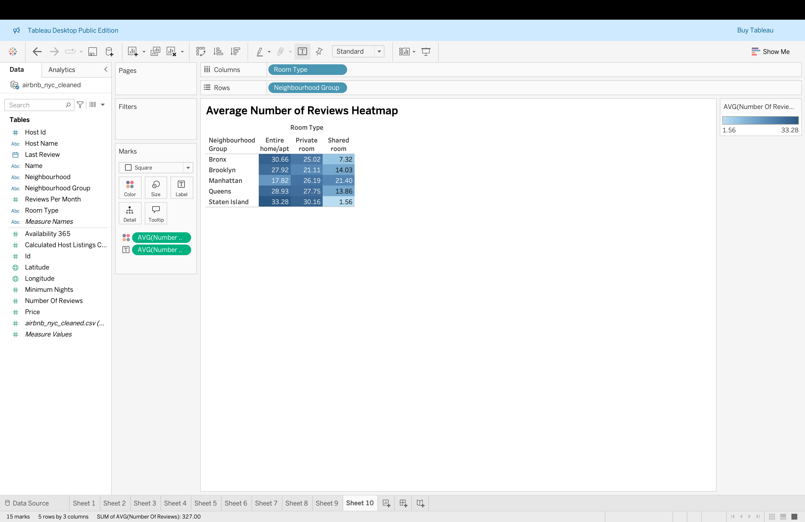

---

### ✅ Python / Jupyter Visuals

> **Exploratory Data Analysis using pandas, seaborn, and matplotlib.**

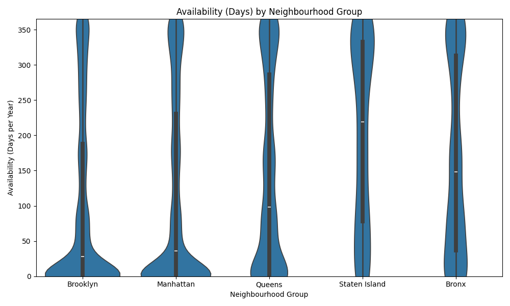
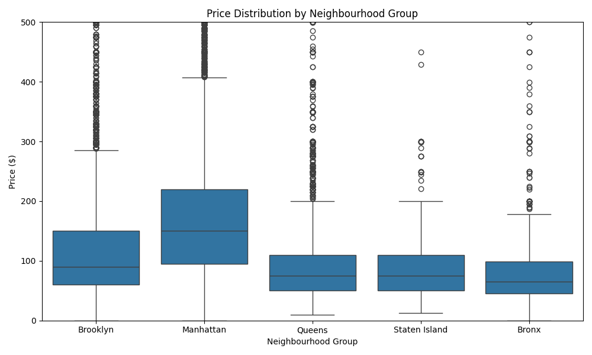
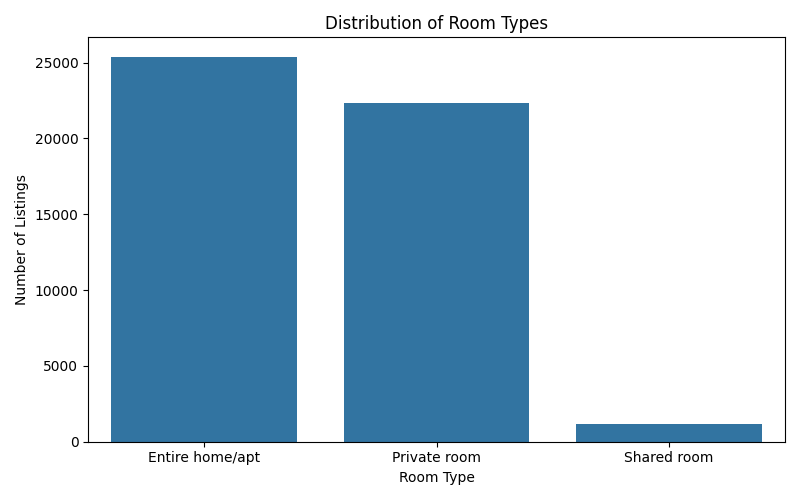
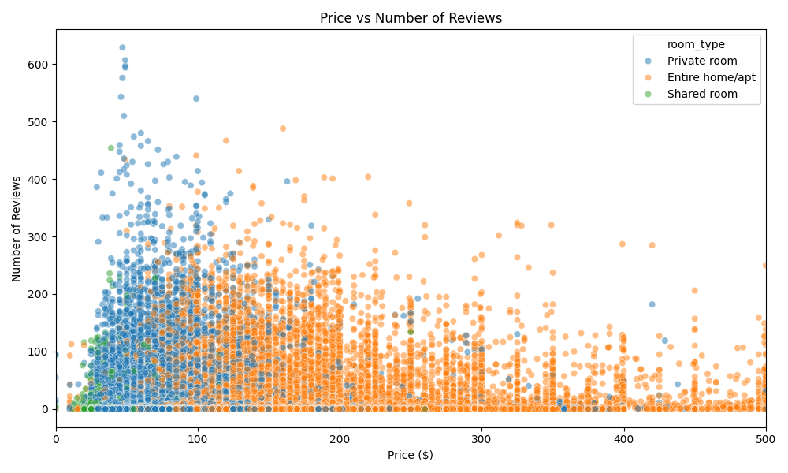
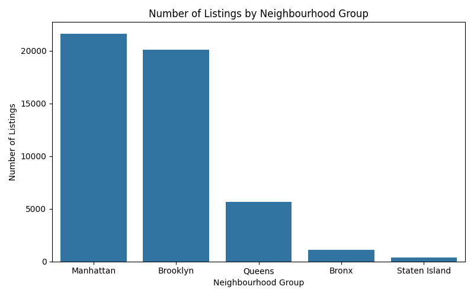
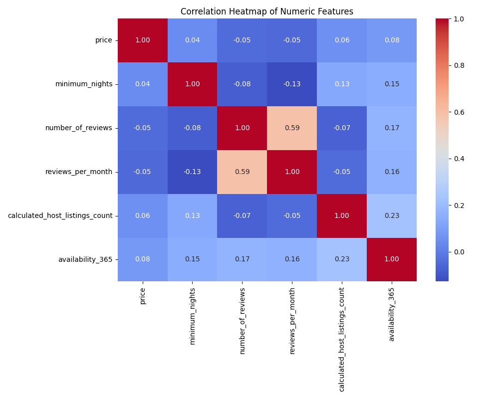
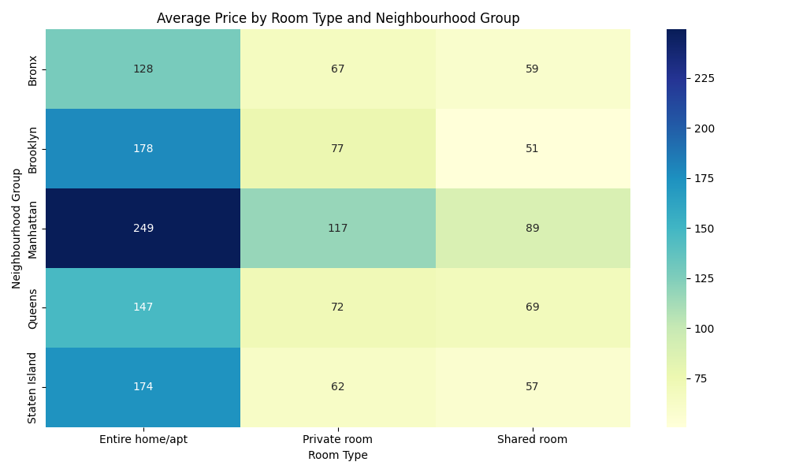


---

## ⚙️ Tools Used

- **Python**: pandas, matplotlib, seaborn for data cleaning and EDA
- **Tableau**: Dashboard creation, interactive analysis, and business-ready visuals
- **Jupyter Notebook**: Structured, step-by-step exploratory workflow

---

## 📦 Project Structure
```
    /images         → All generated graphs and dashboard images
    /data           → Cleaned Airbnb NYC dataset
    /notebooks      → Jupyter Notebook with full analysis
    /dashboard      → Tableau dashboard file
    README.md       → Project summary and visuals

```
---

## 🎯 About This Project

This repository is presented as a professional portfolio case study to demonstrate:

- Practical data wrangling and cleaning skills
- Exploratory data analysis with clear visual outputs
- Interactive business dashboards for stakeholders
- Ability to communicate findings with polished, accessible visuals

All visuals and notebooks are designed to highlight key patterns in NYC’s Airbnb market while maintaining a clean, readable format for potential employers, clients, or collaborators.

---

*Thanks for checking out this analysis!*


